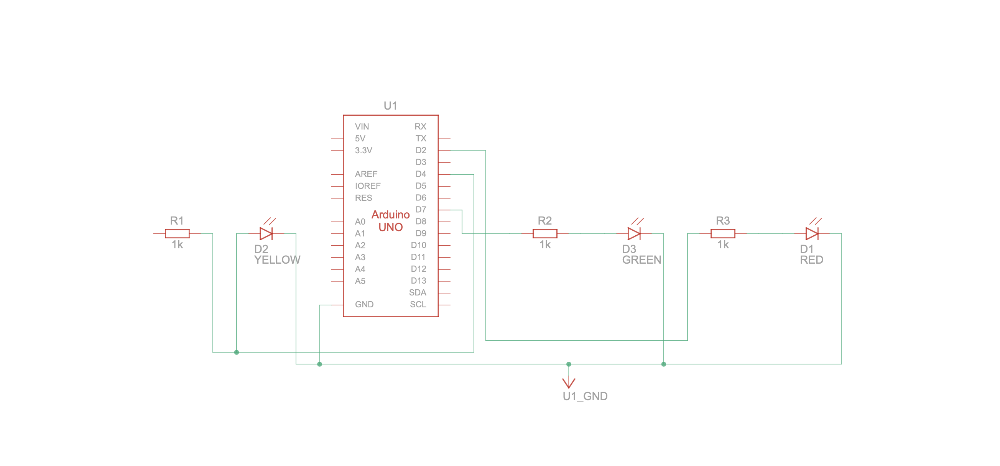

# Traffic Light Project

In this project, We will do simple Traffic Light

### What we need 

* Three Led (red, yellow and green)
* Arduino Uno
* Resistance
* Cables
 
## Diagram





 ## Long Way

```c++
int red = 9;
int yellow = 8;
int green = 7;

void setup(){
  
  pinMode(red, OUTPUT);
  pinMode(yellow, OUTPUT);
  pinMode(green,  OUTPUT);
  
}
void loop(){
digitalWrite(red, HIGH); // give power red led 
 delay(7000); // wait 7 seconds
digitalWrite(red,  LOW); 
  
  digitalWrite(yellow, HIGH); // give power yellow led 
delay(1000); // wait
  digitalWrite(yellow,  LOW);
delay(500);

  digitalWrite(yellow, HIGH);
delay(1000);
  digitalWrite(yellow,  LOW);
delay(500);

  digitalWrite(yellow, HIGH);
delay(1000);
  digitalWrite(yellow,  LOW);
delay(500);
  
  digitalWrite(yellow, HIGH);
delay(1000);
  digitalWrite(yellow, LOW);
delay(500);
  
  digitalWrite(yellow, HIGH);
delay(1000);
  digitalWrite(yellow, LOW);
delay(500);
  
digitalWrite(green, HIGH);
delay(10000);
digitalWrite(green,  LOW);
//  
digitalWrite(yellow, HIGH);
delay(1000);
  digitalWrite(yellow,  LOW);
delay(500);

  digitalWrite(yellow, HIGH);
delay(1000);
  digitalWrite(yellow,  LOW);
delay(500);

  digitalWrite(yellow, HIGH);
delay(1000);  
  digitalWrite(yellow, LOW);
delay(500);
  
  digitalWrite(yellow, HIGH);
delay(1000);
  digitalWrite(yellow, LOW);
delay(500);
  
  digitalWrite(yellow, HIGH);
delay(1000);
  digitalWrite(yellow, LOW);
delay(500);
  
  
}
```

## Short Way

```c++
int red = 2;
int yellow = 4;
int green = 7;

void setup(){
  
  pinMode(red, OUTPUT);
  pinMode(yellow, OUTPUT);
  pinMode(green,  OUTPUT);
  
}
void loop(){
  digitalWrite(red, HIGH);
  delay(7000);
  digitalWrite(red,  LOW);
  Ready();
  digitalWrite(green, HIGH);
  delay(10000);
  digitalWrite(green,  LOW);
  Ready(); // used function
}

void Ready(){ // created loop function
  int i = 0;
  while (i < 6){
  	digitalWrite(yellow, HIGH);
  	delay(1000);
  	digitalWrite(yellow,  LOW);
    delay(500);
  	i ++;
  }
}
```
